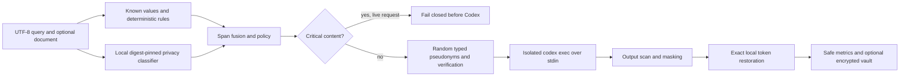

# privacy-codex

`privacy-codex` is an English-only Python 3.11 privacy boundary for read-only
Codex CLI tasks. It detects sensitive spans locally, sends only pseudonymized
content to Codex, scans the returned text, and restores only exact authorized
tokens in local memory.

This repository is a proof of concept, not a production DLP guarantee. The live
path fails closed when the configured local classifier is unavailable. The
explicit `--allow-rules-only` mode exists for development and deterministic
benchmarking.

## What is implemented

- TXT, Markdown, JSON, YAML, and source-code text ingestion.
- Queries from a file, stdin, or an interactive prompt—never a positional
  argument.
- Exact-offset known-value and deterministic detectors.
- Local-only Hugging Face token-classifier adapter with digest verification and
  injectable inference for tests.
- Deterministic span fusion, policy actions, random typed pseudonyms, repeated
  value consistency, verification, and exact restoration.
- Critical payment-card, CVV, credential, and private-key blocking.
- Conservative rejection of semantic escape encodings, Unicode format controls,
  and NFKC confusables that could conceal sensitive values.
- Isolated `codex exec` invocation through a configurable private
  OpenAI-compatible gateway.
- Observable JSONL capture with unknown event preservation; no hidden reasoning
  capture.
- Output leak scanning and masking before authorized restoration.
- Safe audit artifacts plus opt-in AES-256-GCM encrypted raw artifacts.
- Baseline/system/oracle evaluator, deterministic utility metrics, paired
  bootstrap intervals, McNemar statistics, and JSON/CSV/static HTML reports.
- Fifty labelled synthetic English fixtures: 25 extraction and 25 QA cases.

## Architecture



The original document is never copied into the Codex working directory.
`CodexRunner` creates a private temporary directory containing only a fixed
nonsensitive `AGENTS.md`, the bounded redacted stdin and output streams,
isolated configuration/cache directories, and the authoritative `-o` output
file. It starts Codex with `shell=False`, passes the prompt through stdin,
explicitly disables every capability enabled by Codex CLI 0.131.0 plus web and
MCP configuration surfaces, and kills the POSIX child process group on timeout.
Every local detector runs concurrently in a persistent, killable POSIX process;
timed-out workers are forcibly reaped and restarted only for a later request.

## Installation

Use Python 3.11 or newer:

```bash
python3.11 -m venv .venv
source .venv/bin/activate
python -m pip install -e '.[detectors,ml,dev]'
```

Install and pin `codex-cli 0.131.0`, then confirm:

```bash
codex --version
```

The full live configuration needs:

1. An absolute path to a locally available, digest-pinned token-classification
   model.
2. Its `privacy_codex.detectors.directory_digest` value.
3. A local gateway access token injected as `OPENAI_API_KEY`.
4. Access to the configured private gateway, such as
   `https://llm-gateway.example.test/v1`.

The runner defines an invocation-local `private-gateway` model provider whose
credential source is `OPENAI_API_KEY`. The credential exists only in the child
environment; it is absent from argv, logs, and files. User Codex configuration
and authentication state are not loaded. Configure `allowed_gateway_hosts`
with the exact private-gateway host; hosts not on this explicit allowlist are
rejected before process creation.

The model adapter uses `local_files_only=True` and
`trust_remote_code=False`; it does not download a model at runtime. The current
adapter expects a checkpoint compatible with Hugging Face
`AutoModelForTokenClassification`. A privacy-filter packaging adapter can be
added behind the same `Detector` interface if the locally packaged artifact
uses a different runtime format.

Copy `privacy-codex.example.toml`, then set the absolute local model path. CLI
flags override the relevant values.

## Commands

Redact without invoking Codex:

```bash
privacy-codex redact \
  --document example.md \
  --query-stdin \
  --model-path /absolute/path/to/privacy-filter \
  --model-digest DIGEST \
  --output redacted-prompt.txt
```

Run through Codex:

```bash
privacy-codex run \
  --document example.md \
  --query-stdin \
  --model-path /absolute/path/to/privacy-filter \
  --model-digest DIGEST
```

The real run performs CLI-version, authentication, gateway-connectivity, and
model-availability preflight. It uses:

- A configured private OpenAI-compatible gateway, never a direct vendor
  endpoint.
- `gpt-5.6-terra` with medium reasoning by default.
- Read-only sandbox and fresh ephemeral session.
- A five-minute default timeout.
- Invocation-scoped credentials in the child environment only.

For a local deterministic demonstration, add `--allow-rules-only`. This is an
explicitly degraded mode and is not the default live posture.

Enable raw evaluation artifacts only when locally authorized:

```bash
privacy-codex run \
  --query-stdin \
  --allow-sensitive-logs \
  --model-path /absolute/path/to/privacy-filter \
  --model-digest DIGEST
```

`PRIVACY_CODEX_MASTER_KEY` must decode to exactly 32 bytes (base64, URL-safe
base64, or 64 hexadecimal characters). Initialization fails before processing
if AES-GCM or the key is unavailable.

Run the three-arm benchmark:

```bash
privacy-codex evaluate \
  --dataset evals/english_synthetic.jsonl \
  --split test \
  --repeats 3 \
  --variants baseline,system,oracle \
  --allow-unredacted-baseline \
  --model-path /absolute/path/to/privacy-filter \
  --model-digest DIGEST
```

Baseline requests are rejected unless the operator supplies
`--allow-unredacted-baseline`; nonsynthetic baselines are always rejected in v1.
The test split is the default. An unredacted baseline is additionally restricted
to the exact frozen corpus digest checked into this repository. All arms use
fresh Codex sessions and the same configuration hash.

Rebuild safe reports or purge expired runs:

```bash
privacy-codex compare --run runs/eval-RUN-ID --formats json,csv,html
privacy-codex purge --older-than 7d
```

## Policy

| Entity | Live action |
|---|---|
| Payment card, CVV, credential, private key, unknown high risk | `BLOCK` |
| Person, email, phone, private address | `TOKENIZE` |
| Booking, loyalty, account, passport ID | `TOKENIZE` |
| Private date and IP address | `TOKENIZE` |
| Public entity and nonsensitive ID | `ALLOW` |

During synthetic evaluation only, blocked values become non-restorable
`__REMOVED_*__` tokens so their utility impact can be measured. They are never
placed in the reversible token map.

## Artifacts

Each live run creates:

```text
runs/<run-id>/
  manifest.json
  stages.jsonl
  sanitized/
    redacted-prompt.txt
    detections.json
    codex-events.jsonl
    agent-output-redacted.txt
  sensitive/
    original-input.enc
    token-map.enc
    baseline-output.enc
    restored-output.enc
  metrics.json
  report/
```

Directories are mode `0700`; files are mode `0600`. Safe files contain hashes,
offsets, types, actions, versions, counts, timings, usage, exit status, and
sanitized errors—not matched substrings. The store independently rejects
registered originals and normalized variants, common secret shapes, and
Luhn-valid card candidates. Safe Codex events retain event type and bounded
metadata; full event payloads are sensitive artifacts. Raw values are encrypted
only when explicitly enabled and have a seven-day default retention.

## Evaluation semantics

- Privacy: exact/relaxed span precision, recall and F1; character recall;
  critical leak rate; prompt-safe rate; false positives; pseudonym consistency;
  token integrity; restoration; output leaks.
- Utility: JSON/schema validity, field exact/precision/recall/F1, normalized QA
  exact match/token F1, and required-fact preservation.
- Performance: per-stage timings, p50/p95/p99, token usage, prompt-size change,
  and Codex wall time.
- Statistics: case-level paired bootstrap 95% confidence intervals and McNemar
  pass/fail comparison. Incomplete pairs are excluded from paired aggregates
  and counted separately.

The baseline output is diagnostic; every arm is scored against the labelled
expected answer. V1 intentionally has no LLM judge.

## Verification

Run the offline suite:

```bash
PYTHONPATH=src python -m unittest discover -s tests -v
PYTHONPATH=src python scripts/benchmark_redactor.py \
  --dataset evals/english_synthetic.jsonl
```

An explicitly authorized real-gateway smoke test is present but skipped by
default:

```bash
PRIVACY_CODEX_REAL_SMOKE=1 \
PRIVACY_CODEX_MODEL_PATH=/absolute/path/to/privacy-filter \
PRIVACY_CODEX_MODEL_DIGEST=DIGEST \
PYTHONPATH=src python -m unittest tests.test_real_codex_smoke -v
```

Inject `OPENAI_API_KEY` using an approved local secret mechanism; do not put a
literal token in shell history.

The checked-in verification results and remaining feasibility gates are in
`docs/verification.md`.

## Compact edge detector

The package includes an optional data-driven averaged perceptron. It is trained
offline from labelled JSONL spans, saved as a digest-pinned JSON bundle, and
loaded locally with no LLM, network access, or heavyweight runtime dependency:

```bash
privacy-codex train-detector \
  --dataset evals/english_synthetic.jsonl \
  --output work/edge-detector.json \
  --split dev --epochs 12

privacy-codex redact --edge-model-path work/edge-detector.json \
  --edge-model-digest SHA256_OF_FILE --query-stdin
```

Rules remain authoritative for validated formats; the compact model supplies
contextual signals and is fused conservatively. On the included 50-case
synthetic English benchmark, rules plus the edge model achieved exact span
precision/recall/F1 of 1.00 and character recall of 1.00. Warm redaction of a
2,000-token input measured p95 6.1 ms on the reference machine. These are
fixture measurements, not a production accuracy guarantee.

## Boundaries

- English only.
- Prompt-only read-only QA and structured extraction.
- No PDF/DOCX parsing, code modification, MCP, web, arbitrary tools, or GLM.
- Local model availability and in-domain accuracy remain deployment
  responsibilities; rules-only fixture results do not establish production
  accuracy.
- The isolated runner is POSIX-only in v1 because complete process-group
  termination is part of its timeout guarantee.
- Perfect output parity and zero latency are impossible promises. The evaluator
  measures utility loss, while the architecture minimizes overhead with
  concurrent persistent detector workers, one batched classifier request, and
  no generative redaction agent.

Codex CLI behavior follows the official
[non-interactive mode](https://developers.openai.com/codex/noninteractive) and
[configuration reference](https://developers.openai.com/codex/config-reference).
